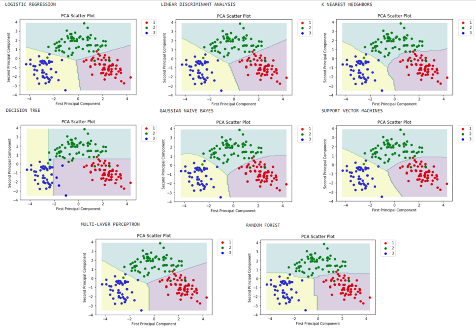

# Machine Learning
Predictive machine learning samples using **python** and **sklearn** library, developed during Master's degree in Advanced Analytics on Big Data.

## Predictive Machine Learning using k Nearest Neighbors classifier
Datasets tested:
- Breast cancer (sklearn)
- Digits (sklearn)
- Wine (UCI repository)

## Predictive Machine Learning models benchmark
Models used:
- k Nearest Neighbors
- Linear Discriminant Analysis
- Linear Regression
- Multi-Layer Perceptron
- Random Forest
- Decision Tree
- Gaussian Naive Bayes
- Support Vector Machines

Datasets tested:
- Breast cancer (sklearn)
- Wine (UCI repository)

**Summary of results of the models benchmark**
- *Breast cancer* dataset:

Scores

Decision boundaries for each model

- *Wine* dataset

Scores

Decision boundaries for each model
